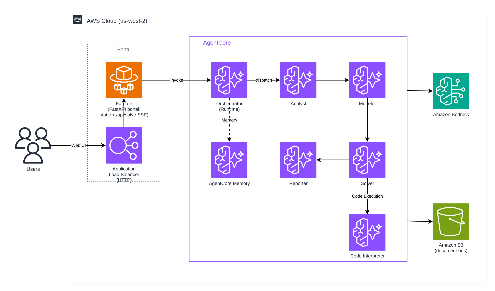

# MathModeler

> 基于 **Amazon Bedrock AgentCore** 构建的多智能体数学建模系统 —— 输入一道开放式数学建模题，自动完成「问题分析 → 数学建模 → 计算求解 → 方案报告」全流程，并以流式方式实时呈现推理与结果。

[English](README.md) | **简体中文**

---

## ✨ 项目亮点

MathModeler 是一个端到端的多智能体（Multi-Agent）应用，完全运行在 **Amazon Bedrock AgentCore** 之上。系统将一个复杂的数学建模任务拆解为多个专业角色，由一个编排智能体（Orchestrator）按依赖关系驱动协作完成：

- **Analyst（分析师）** —— 理解题意、拆解子问题、构建子问题之间的依赖 DAG。
- **Modeler（建模师）** —— 基于分层建模方法库检索候选方法，采用 actor-critic 方式迭代优化数学模型。
- **Solver（求解器）** —— 自动编写并执行代码，遇错自动重试，输出计算结果。
- **Reporter（报告员）** —— 汇总各环节产出，生成结构化的完整解决方案报告。

整个系统的协作、推理与求解过程全部托管在 AgentCore，无需自建容器编排与会话状态管理。

---

## 🏗️ 架构概览



系统充分利用了 Amazon Bedrock AgentCore 的核心能力：

| AgentCore 能力 | 在本项目中的作用 |
| --- | --- |
| **AgentCore Runtime** | 每个智能体（Orchestrator + 4 个子智能体）独立部署为一个 Serverless Runtime，基于 FastAPI 暴露 `/invocations`（POST）与 `/ping`（GET），支持 SSE 流式输出，运行于 `LINUX_ARM64`。 |
| **AgentCore Code Interpreter** | 为 Solver 提供受控的沙箱代码执行环境，安全地运行模型生成的求解代码。 |
| **AgentCore Memory** | 管理会话的短期事件与长期偏好，支撑跨步骤的上下文记忆。 |
| **Amazon S3（文档总线）** | 各智能体之间通过 S3 交换中间产物（按 `session_id` 组织），实现解耦协作。 |

Web 门户由 **AWS Fargate 上的 FastAPI 容器 + Application Load Balancer（HTTP）** 提供服务。ALB 原生以分块/SSE 方式流式转发、不缓冲，因此四阶段进度可实时抵达浏览器；门户同时将 `/api/solve` 代理到 Orchestrator Runtime（`InvokeAgentRuntime`，SigV4），并以单一管理员登录做访问门禁。

智能体使用 **Strands Agents** 框架以 *agents-as-tools* 的模式组织，Orchestrator 既构建监督智能体，又按照确定性的流水线驱动各子智能体顺序协作。


---

## 🚀 部署到 AWS（基于 CDK）

**前置条件**

- 一个 AWS 账户，并在本地配置好凭证 —— 例如执行 `aws configure`（或设置 `AWS_ACCESS_KEY_ID` / `AWS_SECRET_ACCESS_KEY` / `AWS_SESSION_TOKEN` 环境变量，或使用 SSO Profile）。**未配置有效凭证将无法部署。**
- 目标区域（如 `us-west-2`）需已在 Amazon Bedrock 中**开通本项目所用模型的访问权限**。
- 已安装 [Node.js](https://nodejs.org/) 18+ 与 [Docker](https://www.docker.com/)（CDK 会在本地构建各 Agent 容器镜像；由于 Runtime 目标架构为 `LINUX_ARM64`，建议使用 `arm64`/Graviton 机器进行构建）。

**部署步骤**

```bash
# 1. 先配置你自己的 AWS 凭证
aws configure   # 或 export AWS_ACCESS_KEY_ID / AWS_SECRET_ACCESS_KEY / AWS_SESSION_TOKEN

# 2. 使用 CDK 部署（通过 CDK context 传入门户管理员密码）
cd mathmodeler/infra
npm install
npx cdk bootstrap     # 每个账户/区域首次部署时执行一次
npx cdk deploy -c adminUser=admin -c adminPassword='<你的密码>'
```

部署完成后，打开输出的 `PortalEndpoint`（形如 `http://<alb>.<region>.elb.amazonaws.com` 的地址），
用你设置的管理员账号密码登录，提交一道题即可实时观看四阶段流式进展。

> **说明：** 在没有自定义域名 / ACM 证书的情况下，ALB 以 **HTTP** 对外提供服务（默认的
> `*.elb.amazonaws.com` 域名无法签发证书），因此登录密码以明文传输 —— 演示场景可接受。
> 拿到域名后可再加 HTTPS 监听。

---


## 🙏 致谢

本项目受 **[MM-Agent](https://arxiv.org/abs/2505.14148)** 启发，在此致谢。